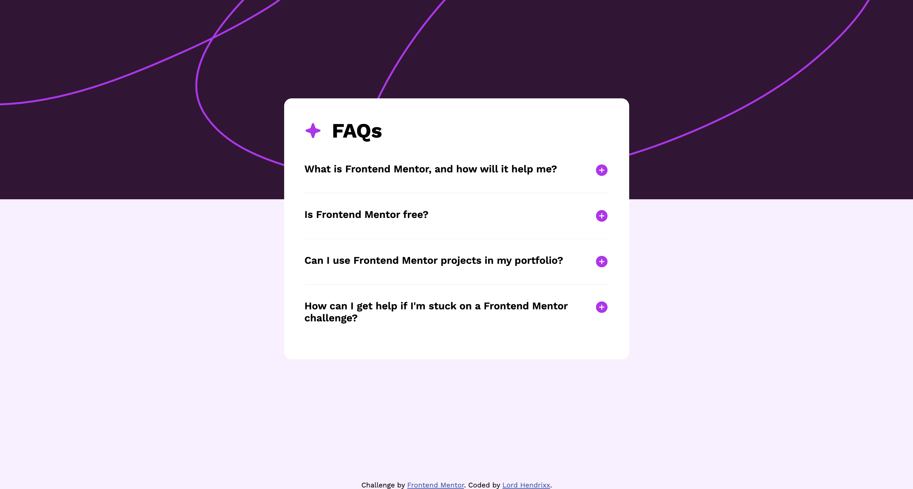

# Frontend Mentor - FAQ accordion solution

This is a solution to the [FAQ accordion challenge on Frontend Mentor](https://www.frontendmentor.io/challenges/faq-accordion-wyfFdeBwBz). Frontend Mentor challenges help you improve your coding skills by building realistic projects. 

## Table of contents

- [Overview](#overview)
  - [The challenge](#the-challenge)
  - [Screenshot](#screenshot)
  - [Links](#links)
- [My process](#my-process)
  - [Built with](#built-with)
  - [Continued development](#continued-development)
  - [Useful resources](#useful-resources)
- [Author](#author)
- [Acknowledgments](#acknowledgments)

**Note: Delete this note and update the table of contents based on what sections you keep.**

## Overview

### The challenge

Users should be able to:

- Hide/Show the answer to a question when the question is clicked
- Navigate the questions and hide/show answers using keyboard navigation alone
- View the optimal layout for the interface depending on their device's screen size
- See hover and focus states for all interactive elements on the page

### Screenshot

### Links

- Solution URL: [Vercel](https://faq-accordion-git-main-beealmightys-projects.vercel.app/)
- Live Site URL: [Live Server](http://127.0.0.1:5500/)

## My process

### Built with

- Semantic HTML5 markup
- CSS custom properties
- Flexbox
- CSS Grid
- Mobile-first workflow
- JS

### Continued development

I want to go deeper into javscript fundamentals and advanced topics.

### Useful resources

- [Stack Overflow](https://www.stackoverflow.com) 
- [w3 schools](https://www.w3schools.com)

## Author
- Frontend Mentor - [Lord Hendrixx](https://www.frontendmentor.io/profile/beealmighty)
- Twitter - [Maduakonam Moses](https://www.twitter.com/Maduakonam67451)

## Acknowledgments

- I want to thank Stack Overflow for their help with this project.

